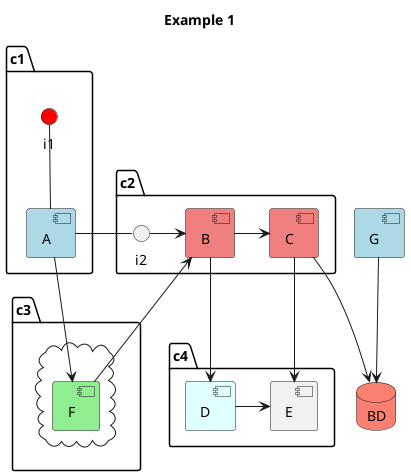
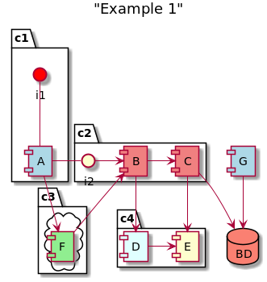

Library to generate plantuml code from python objects

### Example

```python
diagram1 = Diagram(
    name="Example 1",
    opts={
        DiagramOptName.AUTO_NUMBER: True,
        DiagramOptName.AUTO_NUMBER_START: 1,
        DiagramOptName.ADD_SEPARATORS: True,
        DiagramOptName.TITLE: "Example 1",
    },
    type_=DiagramType.COMPONENT,
    objs=[
        Container(
            name="c1",
            objs=[
                Class(
                    name="i1",
                    type_=ClassType.INTERFACE_LOLLIPOP,
                    shape_attrs={
                        ShapeAttributeName.COLOR: Color.RED.value,
                    }
                
                ),
                Component(
                    name="A",
                    shape_attrs={ShapeAttributeName.COLOR: Color.LIGHT_BLUE.value, }
                )
            ]
        ),
        Container(
            name="c3",
            objs=[
                Container(
                    name=" ",
                    objs=[
                        Component(
                            name="F",
                            shape_attrs={ShapeAttributeName.COLOR: Color.LIGHT_GREEN.value, }
                        ),
                    ],
                    container_type=ContainerShapeType.CLOUD
                ),
            ],
        ),
        Container(
            name="c2",
            objs=[
                Class(
                    name="i2",
                    type_=ClassType.INTERFACE_LOLLIPOP
                ),
                Component(
                    name="B",
                    shape_attrs={ShapeAttributeName.COLOR: Color.LIGHT_CORAL.value, }
                ),
                Component(
                    name="C",
                    shape_attrs={ShapeAttributeName.COLOR: Color.LIGHT_CORAL.value, }
                ),
            ]
        ),
        Container(
            name="c4",
            objs=[
                Component(
                    name="D",
                    shape_attrs={ShapeAttributeName.COLOR: Color.LIGHT_CYAN.value, }
                ),
                Component(
                    name="E",
                ),
            ]
        ),
        Component(
            name="BD",
            shape_attrs={
                ShapeAttributeName.COLOR: Color.SALMON.value,
                ShapeAttributeName.CONTAINER_SHAPE_TYPE: ContainerShapeType.DATABASE.value
            },
        ),
        Component(
            name="G",
            shape_attrs={
                ShapeAttributeName.COLOR: Color.LIGHT_BLUE.value,
            },
        ),
    ],
    relations=[
        # i1
        Relation(
            obj1="i1",
            rel_type=RelationType.Association,
            obj2="A",
            orientation=Orientation.DOWN
        ),
        # A
        Relation(
            obj1="A",
            rel_type=RelationType.Call,
            obj2="F",
            orientation=Orientation.DOWN
        ),
        Relation(
            obj1="A",
            rel_type=RelationType.Association,
            obj2="i2",
            orientation=Orientation.RIGHT
        ),
        
        # i2
        Relation(
            obj1="i2",
            rel_type=RelationType.Call,
            obj2="B",
            orientation=Orientation.RIGHT
        ),
        
        # B
        Relation(
            obj1="B",
            rel_type=RelationType.Call,
            obj2="D",
            orientation=Orientation.DOWN
        ),
        Relation(
            obj1="B",
            rel_type=RelationType.Call,
            obj2="C",
            orientation=Orientation.RIGHT
        ),
        
        # C
        Relation(
            obj1="C",
            rel_type=RelationType.Call,
            obj2="E",
            orientation=Orientation.DOWN
        ),
        Relation(
            obj1="C",
            rel_type=RelationType.Dependency,
            obj2="BD",
            orientation=Orientation.DOWN
        ),
        
        # D
        Relation(
            obj1="D",
            rel_type=RelationType.Call,
            obj2="E",
            orientation=Orientation.RIGHT
        ),
        
        # E
        # EMPTY
        
        # F
        Relation(
            obj1="F",
            rel_type=RelationType.Call,
            obj2="B",
            orientation=Orientation.UP
        ),
        
        # G
        Relation(
            obj1="G",
            rel_type=RelationType.Dependency,
            obj2="BD",
            orientation=Orientation.DOWN
        ),
    ],
)
plantuml_code, got_errors = diagram.gen_code(CodeGenerator.Context(code_style=style))

```
----
##### Generated code:



---
##### Rendered img

